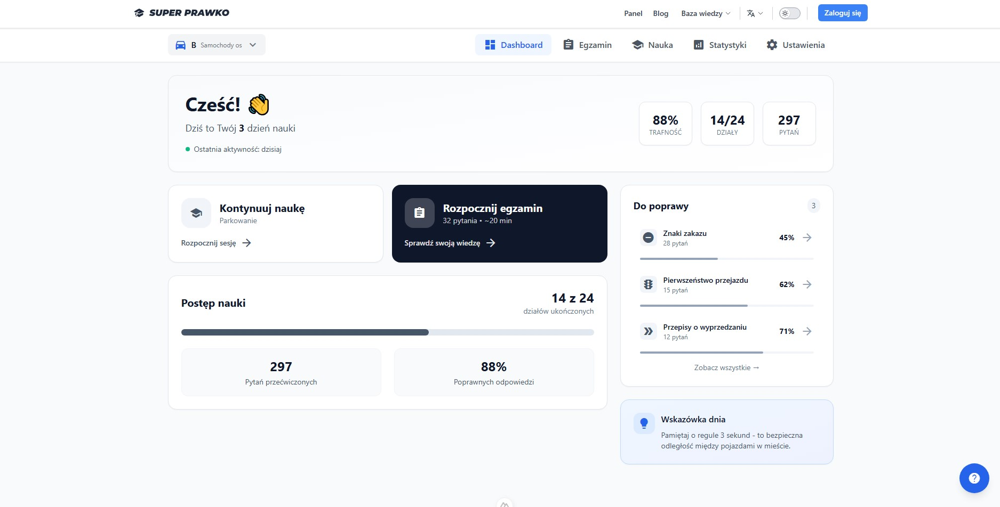
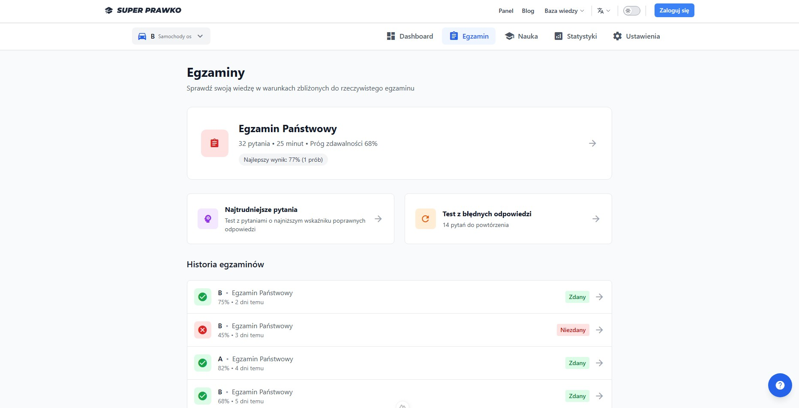
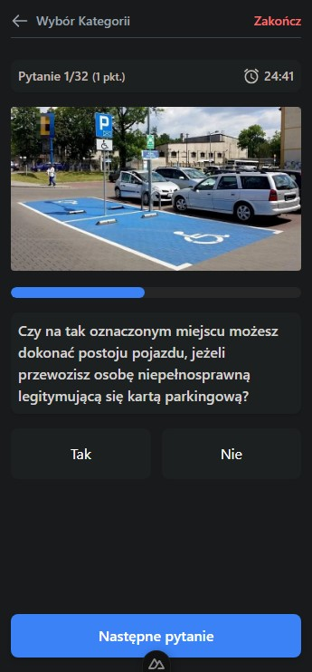
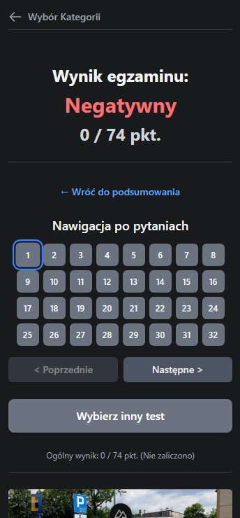
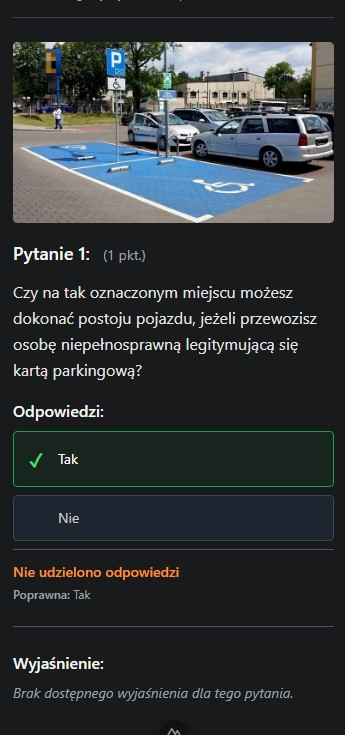

# SUPER PRAWKO 🇵🇱

> Nowoczesna aplikacja webowa stworzona w Nuxt.js do nauki i przygotowania się do egzaminu teoretycznego na prawo jazdy w Polsce.

## 📋 Spis Treści

- [O Aplikacji](#o-aplikacji)
- [Funkcjonalności](#funkcjonalności)
- [Zrzuty Ekranu](#zrzuty-ekranu)
- [Stos Technologiczny](#stos-technologiczny)
- [Jak Zacząć](#jak-zacząć)
- [Planowane Funkcjonalności](#planowane-funkcjonalności)

## 🎯 O Aplikacji

**SUPER PRAWKO** to kompleksowe narzędzie dla kandydatów na kierowców, umożliwiające skuteczne przygotowanie się do państwowego egzaminu teoretycznego. Aplikacja oferuje realistyczną symulację egzaminu z wykorzystaniem oficjalnej bazy pytań zgodnej z polskimi przepisami.

## ✨ Funkcjonalności

### 🎮 Symulacja Egzaminu Państwowego

- **Oficjalna struktura egzaminu**: 32 pytania zgodnie z wymogami państwowymi
  - **20 pytań podstawowych** z odpowiedziami TAK/NIE
  - **12 pytań specjalistycznych** z opcjami A/B/C
- **System czasowy**: 30 sekund na każde pytanie
- **Automatyczne losowanie** pytań z oficjalnej bazy danych
- **Wybór kategorii** prawa jazdy

### 📚 Tryb Nauki _(wkrótce dostępny)_

- Nauka podzielona na działy tematyczne
- Możliwość skupienia się na konkretnych obszarach wiedzy
- Progresywne uczenie się

### 📊 Panel Wyników

- **Natychmiastowa ocena**: status zdany/niezdany
- **Szczegółowa analiza**: przegląd wszystkich odpowiedzi
- **Identyfikacja błędów**: podgląd pytań z nieprawidłowymi odpowiedziami
- **Możliwość powtórki**: analiza konkretnych pytań

### 🎨 Interfejs Użytkownika

- **Responsywny design**: optymalizacja dla desktop i mobile
- **Tryb ciemny**: komfort użytkowania

## 📱 Zrzuty Ekranu

### Dashboard

### Widok Egzaminu

_Interfejs egzaminu z pytaniem, materiałami multimedialnymi, opcjami odpowiedzi i licznikami czasu._

### Podsumowanie Wyników

_Ekran wyników z oceną końcową, statusem zdany/niezdany i przeglądem wszystkich pytań._

### Wersja Mobilna

  
  
  

## 🛠️ Stos Technologiczny

- **Nuxt.js/Vue.js** - framework aplikacji
- **Pinia** - zarządzanie stanem aplikacji
- **Tailwind CSS** - stylowanie i responsywność
- **Laravel API** - serwer aplikacji i API
- **Baza danych** - SQLite

## 📈 Planowane Funkcjonalności

- [ ] **Tryb nauki z działami** - systematyczna nauka według tematów
- [ ] **Statystyki postępów** - śledzenie rozwoju umiejętności
- [ ] **Tryb offline** - nauka bez połączenia internetowego
- [ ] **Wyjaśnienia do pytań** - szczegółowe omówienia
