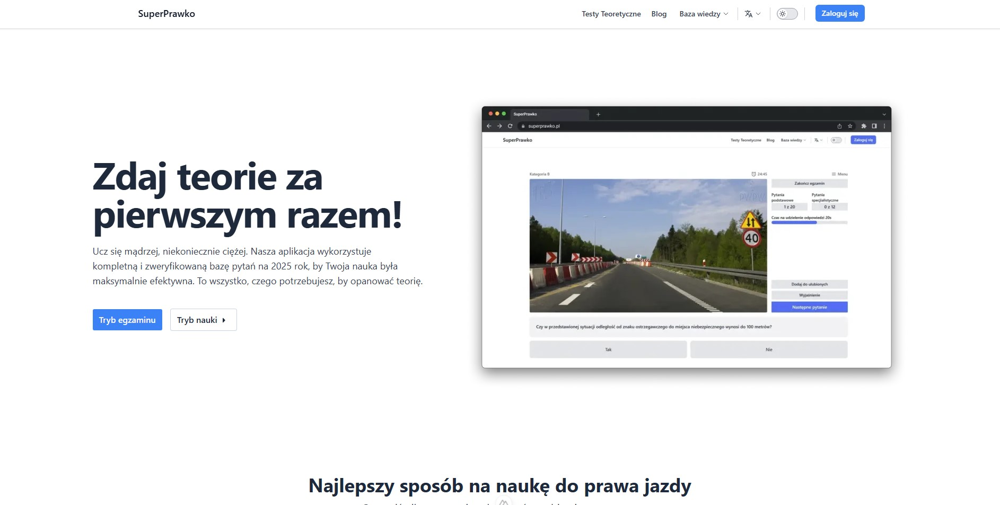
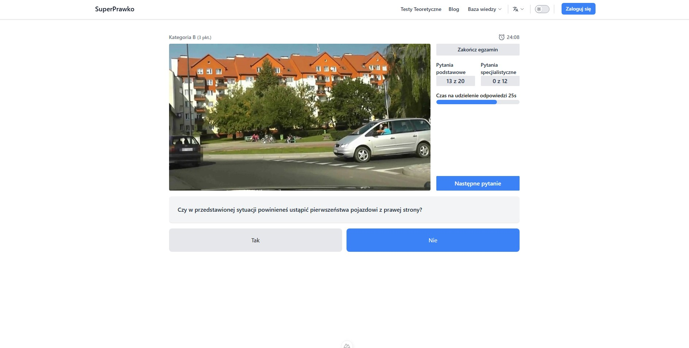
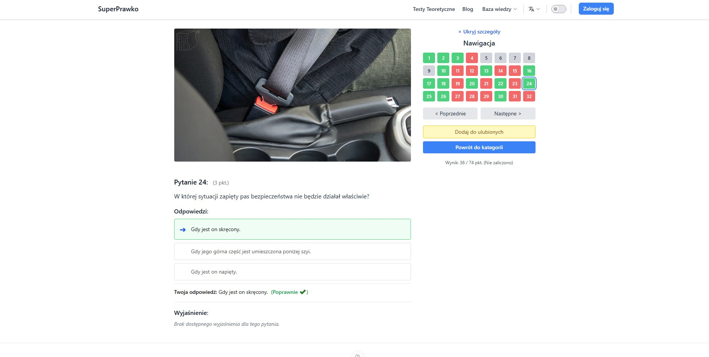

# SuperPrawko 🇵🇱 🚗

> A modern web application built with Nuxt.js for practicing the official Polish driving theory test.

## About

SuperPrawko helps Polish driver candidates prepare for the national driving theory exam. It provides a realistic simulation using the official question database.

**Key Features:**

- realistic exam simulation (structure, timing, rules)
- Official & up-to-date question database (images & videos included)
- Detailed results review (score, pass/fail, question analysis)
- Clean, responsive UI (Desktop & Mobile)
- Dark Mode support

## Screenshots

**Exam View**

_Exam interface showing question, media, options, and timers._

**Results Summary**

_Post-exam screen with score, pass/fail status, and question grid._

## Tech Stack

- **Frontend:** Nuxt/Vue, Pinia, Tailwind CSS
- **Backend:** Laravel API.
