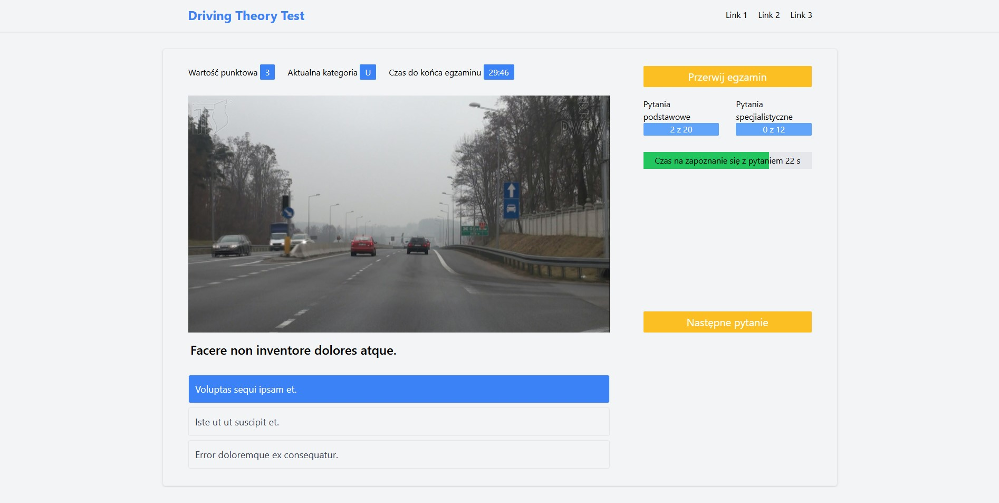
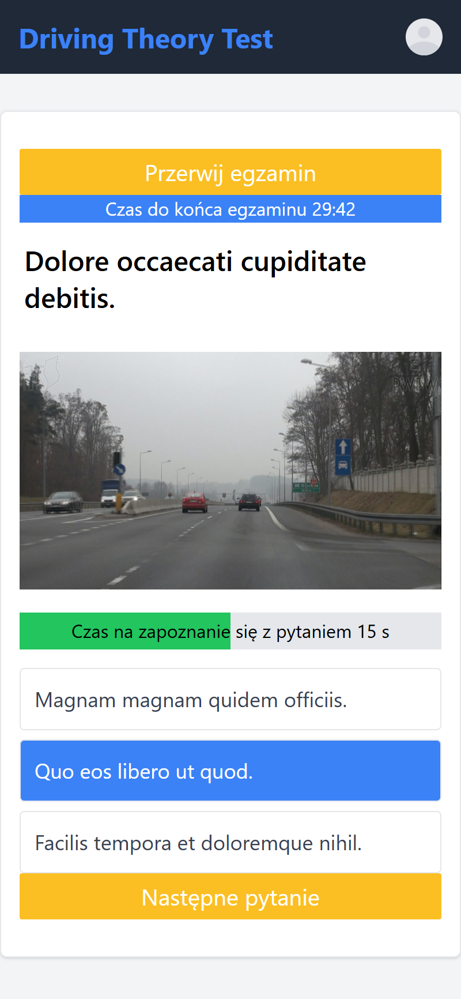
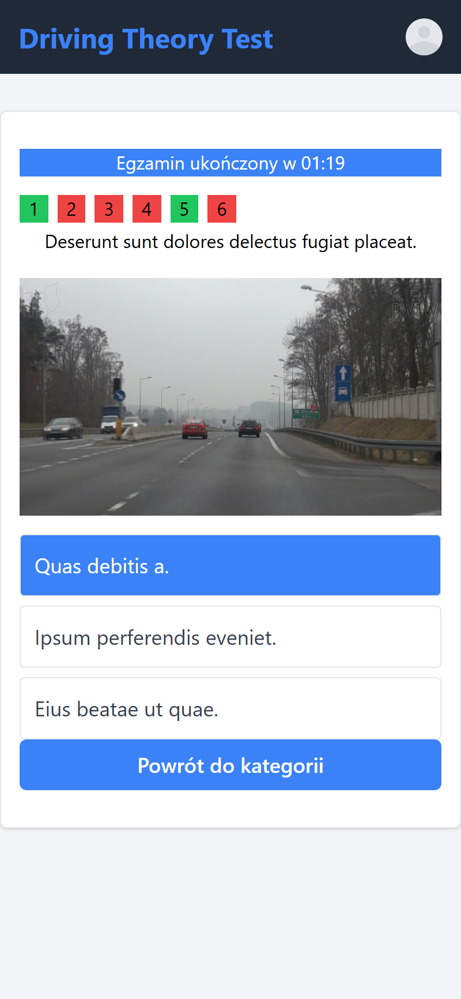

# Driving Theory Test Application



This is a web application designed to help users prepare for driving license exams by practicing with official test questions. The questions are sourced from the Polish government's official website [gov.pl](https://www.gov.pl/web/infrastruktura/prawo-jazdy), ensuring they match the ones used in real driving tests.




## Demo

Here is a working live demo : `Future`

## Built with

- Laravel API for backend
- Vue for frontend
- SQLite for database

## Features

- **Mobile-Friendly:** The app is fully responsive, allowing users to practice on any device.
- **Real Exam Simulation:** Take interactive multiple-choice tests that closely resemble actual driving exams.
- **Official Questions:** All questions are taken from the official database, ensuring accuracy and relevance.
- **Instant Feedback:** Get immediate results and explanations after completing a test to improve learning.
- **User Accounts:** Users can register, log in, and track their progress.
- **Progressive Web App (PWA) Support (Future):** In the future, the app may evolve into a full PWA, allowing offline access and push notifications.

## Installation & Setup

```
git clone https://github.com/pdemianowicz/driving-theory-test.git

cd driving-test-app/backend
composer install
php artisan migrate:fresh --seed
php artisan serve

cd driving-test-app/frontend
npm install
npm run dev
```

The app will be available at `http://localhost:5173`
